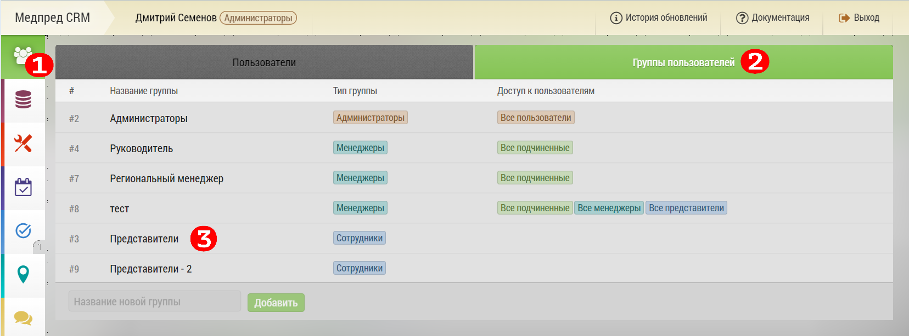
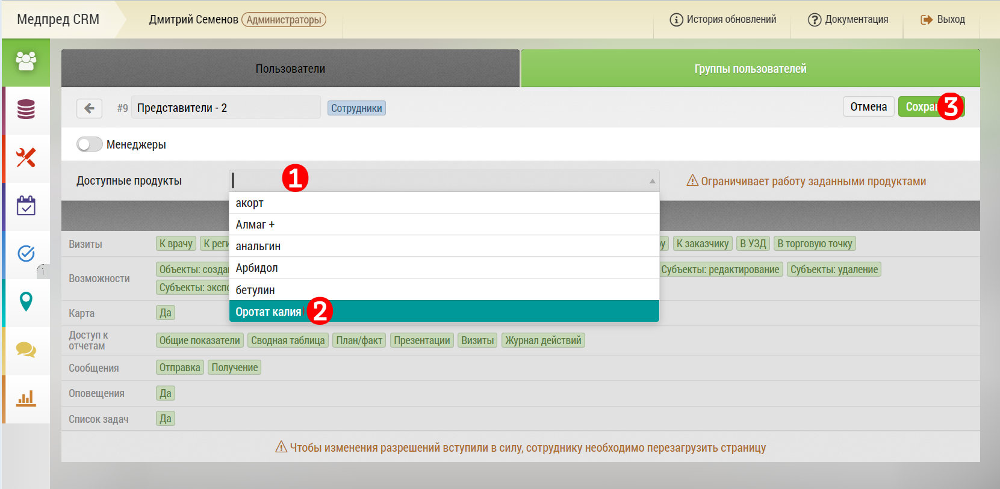
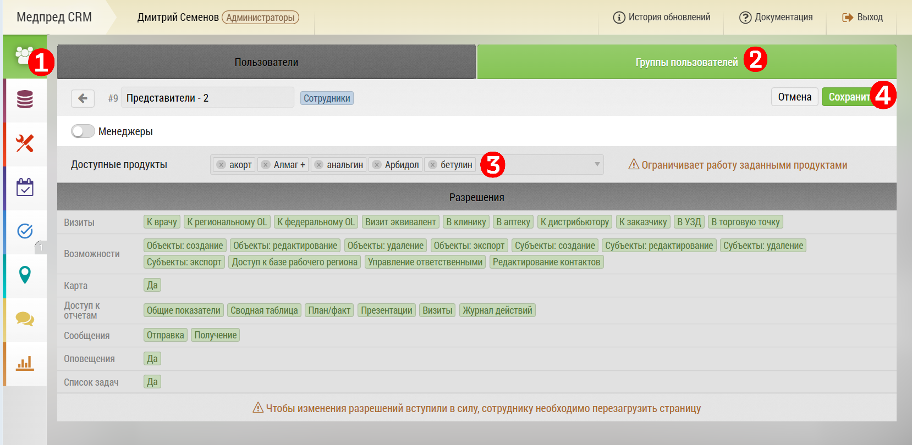

# Ограничение видимости продуктов по группам пользователей

>`Администратор`

Редактирование "Группы пользователей" происходит в интерфейсе "[группы пользователей](accounts-group.html)".

Для управления видимостью продуктов для групп пользователей, перейдите на вкладку «Пользователи» `1` 

Выберите вкладку «Группы пользователей» `2`

Из названий групп выберите конкретную группу, которой хотите добавить продукты `3` 

Откроется окно выбранной группы пользователей.

## Настройка видимости продуктов

Наведите курсор и нажмите на поле «Доступные продукты» `1`

В выпадающем меню начните вводить название препарата, далее выберите интересующий Вас продукт из предложенного списка `2`

Нажмите кнопку «Сохранить» `3`

 > Вы можете присваивать группе неограниченное количество продуктов, все они будут отображены в описании группы.

 > При включении настройки, пользователи группы будут видеть только заданные продукты, а не все продукты из списка.
 
 ## Удаление ограничения видимости продуктов.

Для удаления ограничения видимости продуктов для групп пользователей, перейдите на вкладку «Пользователи» `1`

Выберите вкладку «Группы пользователей» `2`

Удалите продукты, нажав на крестик перед продуктами `3`

Нажмите кнопку «Сохранить» `4`

 По умолчанию всем группам доступны все продукты. При выборе хотя бы одного продукта, остальные продукты для группы, автоматически становятся недоступны. 

 >Для группы Администраторы возможность ограничивать самому себе продукты - не доступна.
