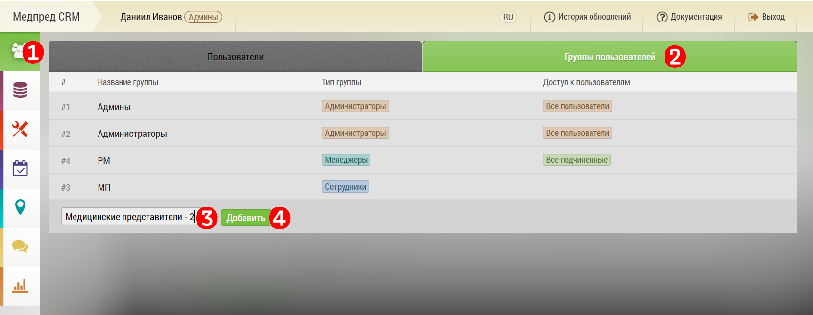

# Создание группы

"Группа пользователей" создается в интерфейсе "[группы пользователей](accounts-group.html)".

Чтобы создать новую группу нужно: 

1. Перейти на вкладку Управление пользователями
2. Выбрать вкладку Группы пользователей
3. в интерфейсе "[группы пользователей](accounts-group.html)" в поле "Название новой группы" ввести название группы
4. Нажать кнопку: 

Будет создана новая группа.

Далее группу нужно [отредактировать](accounts-group-edit.html)
