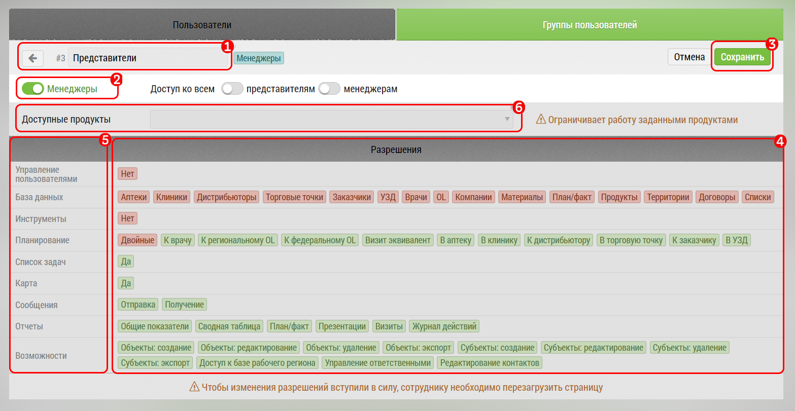

## Редактирование группы. Переключатель "Менеджер/Сотрудник". Настройка прав и их значение

Редактирование "Группы пользователей" происходит в интерфейсе "[группы пользователей](accounts-group.md)".

Блок редактирования группы состоит из:

1. Названия - тут же его можно изменить
2. Переключателя Менеджер/Сотрудник
3. Кнопки "Удалить"
4. Переключателей прав доступа
5. Виды прав доступа

[1] и [2] после изменения необходимо подтвердить появляющейся кнопкой "Сохранить".

> При удалении группы [3], подтверждения не запрашивается - группа удаляется сразу, без возможности восстановления

> Переключатели прав доступа [4] сохраняются сразу после нажатия - изменения применяются сразу.

На текущий момент права доступа делятся на следующие виды:

- Визиты: определяет какие виды визитов доступны пользователю, например:

  -  двойные
  - к врачам
  - эквивалент
  
- Управление пользователями: есть ли доступ к управлению пользователями
- Управление данными: определяет к каким вкладкам есть доступ в "База Данных", например: 

  - врачи
  - препараты
  - списки
  - корзина

- Инструменты: есть ли доступ к инструментам. На текущий момент есть только "Дедубликация"
- Доступ к отчетам: есть ли доступ к отчетам
- Сообщения: есть ли возможность отправлять/получать сообщения

Некоторые доступы - например доступ к пользователям не имеют смысла для сотрудников(не менеджеров).
