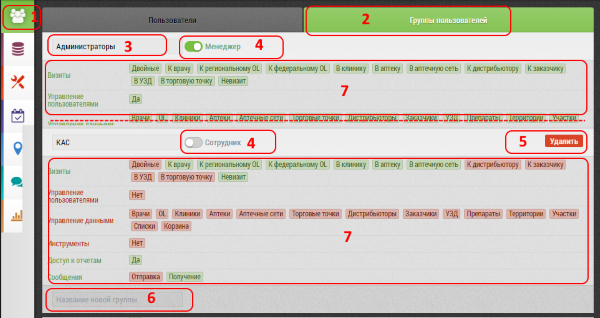

## Группы пользователей. Общее описание и список возможностей (создание, редактирование)

`Администратор`

Группы пользователей предназначены для создания групп пользователей с различными правами и доступами.
С помощью "групп пользователей" можно гибко настраивать права доступа к объектам, субъектам, данным, отчетам.

Интерфейс "групп пользователей" включает:

1. Кнопка перехода к управлению пользователями (зеленый фон - активно в текущий момент)
2. Вкладки переключения между управлением [пользователями](accounts-user.md) и группами (зеленый фон - активная вкладка)
3. Название группы (его можно изменить нажав на это поле - в том числе и у системных групп - первых трех - администраторы, менеджеры, медпреды)
4. Переключатель менеджер/сотрудник - разница в том что у менеджера могут быть подчиненные
5. Кнопка "Удалить" - удалить группу 
6. Поле для [создания](accounts-group-create.md) новой группы
7. [Редактирование](accounts-group-edit.md) группы. Состояние разрещено/запрещено переключается щелчком

>Удалить можно только не системные - т.е. созданные самостоятельно группы
