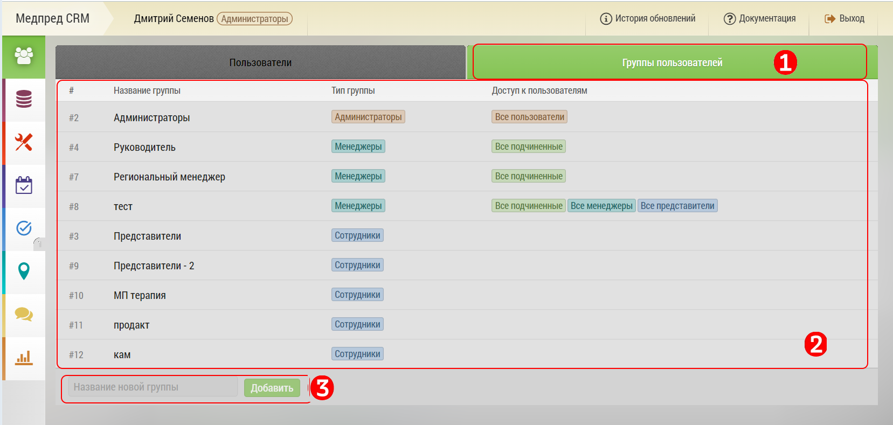

# Группы пользователей

`Администратор`

Группы пользователей предназначены для создания групп пользователей с различными правами и доступами.
С помощью "групп пользователей" можно гибко настраивать права доступа к объектам, субъектам, данным, отчетам.

Интерфейс "групп пользователей" включает:

1. Кнопка перехода к управлению пользователями (зеленый фон - активно в текущий момент)

2. Информация о текущих группах, их типах и доступах к управлению другими группами.

3. Поле для [создания](accounts-group-create.html) новой группы

Для выбора [редактирование](accounts-group-edit.html) группы выберите группу двойным щелчком. Откроется интерфейс редактирования группы.

