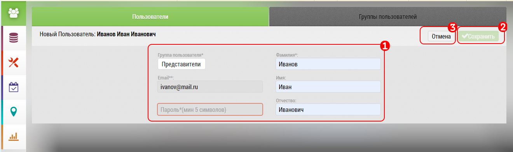

## Добавление нового пользователя

Для создания нового пользователя нажмите кнопку [5], в [интерфейсе управления пользователями](accounts-user.md).

В окне добавления пользователя:

1. Заполните поля: ФИО, телефон, емейл, пароль
2. Нажмите на кнопку "Сохранить".
3. Если передумали - нажмите кнопку "Отмена"

`Функционал [4] - фотография пользователя в данный момент не реализован`

Не обязательно сразу заполнять все данные - их можно добавить и позднее, при [редактировании пользователя](accounts-user-edit.md).
Там же нужно будет дозаполнить данные пользователя.

Пользователю будет автоматически назначен менеджер - тот кто добавил пользователя.
