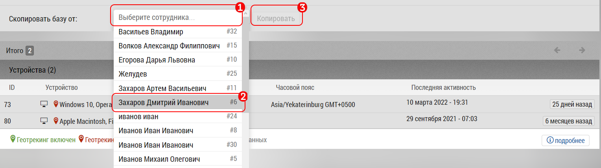

## Копирование базы пользователя другому пользователю

Иногда нужно скопировать базу пользователя другому пользователю.
Например когда уходит сотрудник и его базу нужно передать кому-нибудь другому, например новичку.

> Скопировать любую базу может только администратор. 
> Менеджер может скопировать базу только своих подчиненных.

Копирование базы происходит происходит в интерфейсе [редактирования пользователя](accounts-user-edit.md).

Чтобы скопировать базу от одного пользователя (Пользователь №1), другому (Пользователь №2), нужно.
 - Зайти в интерфейс редактирования пользователя №2.

 - нажать на "Выберите сотрудника" [1]
 - выбрать в всплывающем списке сотрудника № 1 [2]
 - нажать на кнопку "Копировать" [3]
 
После копирования будет выведено всплывающее окно с информацией о добавленных или уже находящихся в базе объектах/субъектах.

