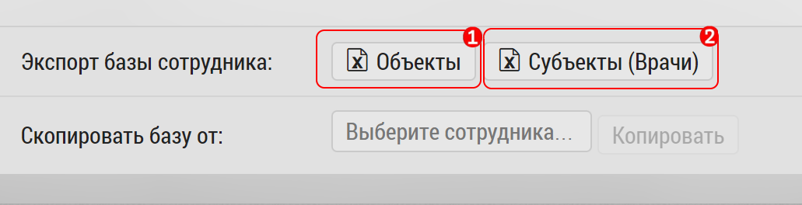

## Выгрузка базы пользователя

Выгрузка базы пользователя, предназначена для быстрой выгрузки объектов/субъектов пользователя в формат xlsx.
Выгружается база пользователя с разбивкой на объекты и субъекты.

Выгрузка происходит в интерфейсе [редактирования пользователя](accounts-user-edit.md).

 Чтобы выгрузить базу необходимо:
   - перейти в интерфейс редактирования пользователя
   
   
   
   - нажать кнопку "Выгрузить" [1]
   
После успешной выгрузки пользователь получит файл: 

Это обычный файл формата xlsx, разбитый по листам на объекты/субъекты и содержащий такие поля как, например:

-  id	
-  Тип	
-  Специальность	
-  Фио	
-  Телефон
-  ...
-  Место работы	
