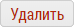
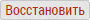

## Удаление и восстановление пользователя

Удаление пользователя происходит в интерфейсе [редактирования пользователя](accounts-user-edit.md).

>Пользователь не удаляется насовсем. Его можно востановить.
>При удалении пользователя его объекты/субъекты остаются.

Чтобы удалить пользователя необходимо
- перейти в интерфейс редактирования пользователя
или 
- в список пользователей (`только администраторы`)
- нажать кнопку: 
- подтвердить удаление

Чтобы восстановить пользователя необходимо: 
- перейти в "[Корзину](database-trash.md)" (`База Данных -> Корзина -> Пользователи`)
- нажать кнопку: 
