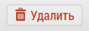
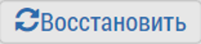

# Удаление и восстановление пользователя

Удаление пользователя происходит в интерфейсе [редактирования пользователя](accounts-user-edit.html).

>Пользователь не удаляется насовсем. Его можно востановить.
>При удалении пользователя его объекты/субъекты остаются.

Чтобы удалить пользователя необходимо
- перейти в интерфейс редактирования пользователя
или 
- в список пользователей (`только администраторы`)
- нажать кнопку: 
- подтвердить удаление

Чтобы восстановить пользователя необходимо: 

- перейти в "[Управление пользователями](accounts-user.html)" (`Управление пользователями -> Пользователи`) - для этого должны быть соответствующие права

Нажать перключатель `1` - Удаленные (надпись станет активной - зеленого цвета)

С помощью кнопки `2` - Поиск, выбрать удаленного пользователя

`3` - Восстановить пользователя: 

 
- нажать кнопку: 
