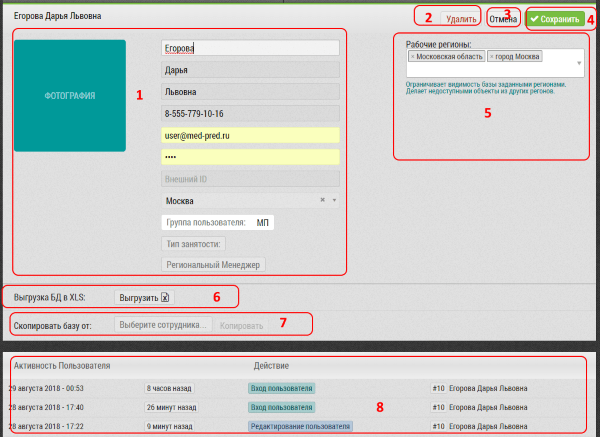

# Редактирование пользователя. Описание элементов страницы и возможностей

Интерфейс редактирования пользователя предназначен для просмотра, редактирования данных пользователя.
Также можно выгрузить базу пользователя, скопировать ему базу другого пользователя, удалить пользователя.

Интерфейс редактирования пользователя состоит из:

1. Фото пользователя (можно загрузить)
2. Кнопка "Удалить" - [удалить пользователя](accounts-user-delete.html)
3. Кнопка "Отмена" - выйти из режима редактирования
4. Кнопка "Сохранить" - сохранить внесенные изменения
5. Данных пользователя: (ФИО, тф, емейл), внешний id (для синхронизации с внешней системой), город, должность, региональный менеджер, новый пароль, часовой пояс
6. Переключатель Активная/Неактивная учетная запись
7. [Блок "Рабочие Регионы"](accounts-user-region.html) - для настройки видимости объектов/субъектов пользователя
8. [Выгрузка бд пользователя в XLS](accounts-user-base-export.html)
9. [Блок для копирования пользователю базы другого пользователя](accounts-user-base-copy.html)
10. Лог активности пользователя
11. Информация о статусах геоверификации

