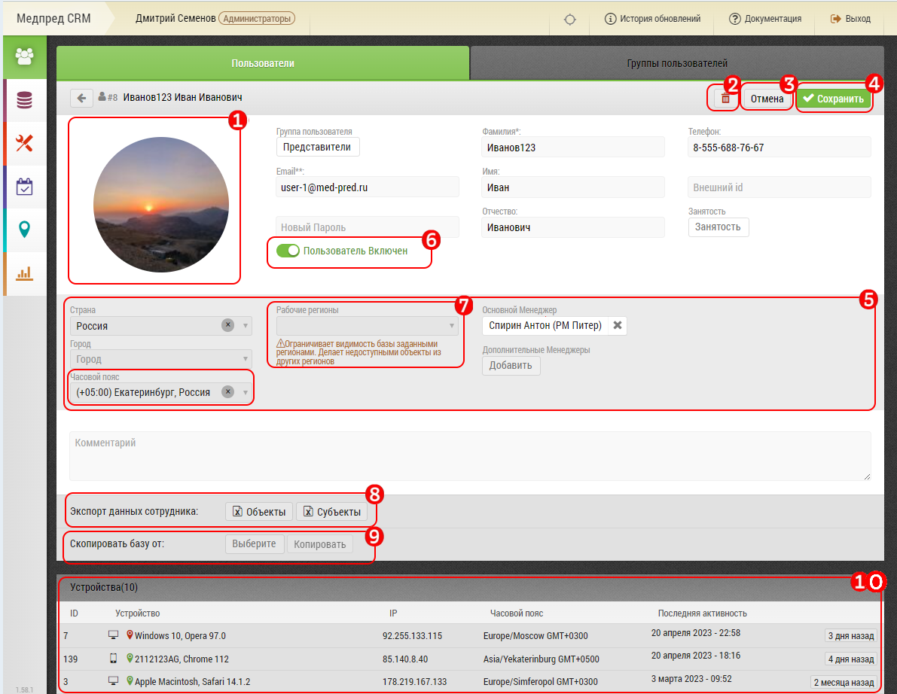

## Редактирование пользователя. Описание элементов страницы и возможностей

Интерфейс редактирования пользователя предназначен для просмотра, редактирования данных пользователя.
Также можно выгрузить базу пользователя, скопировать ему базу другого пользователя, удалить пользователя.

Интерфейс редактирования пользователя состоит из:

1. Данных пользователя: (ФИО, тф, емейл), внешний id (для синхронизации с внешней системой), город, должность, региональный менеджер
2. Кнопка "Удалить" - [удалить пользователя](accounts-user-delete.md)
3. Кнопка "Отмена" - выйти из режима редактирования
4. Кнопка "Сохранить" - сохранить внесенные изменения
5. [Блок "Рабочие Регионы"](accounts-user-region.md) - для настройки видимости объектов/субъектов пользователя
6. [Выгрузка бд пользователя в XLS](accounts-user-base-export.md)
7. [Блок для копирования пользователю базы другого пользователя](accounts-user-base-copy.md)
8. Лог активности пользователя
