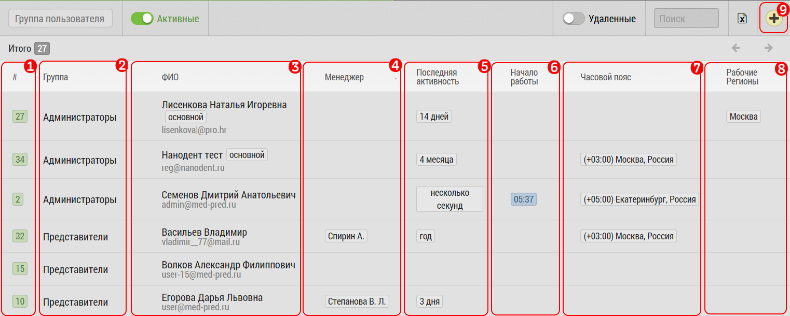

## Таблица с описанием каждого поля

Список пользователей отображает основную информацию по каждому пользователю.

1. Номер пользователя (задается автоматически)
2. ФИО пользователя
3. Статус геоверификации пользователя (можно уточнить по кнопке [9] "Подробнее")
4. E-mail - он же логин пользователя
5. Менеджер пользователя (у пользователя может и не быть менеджера)
6. [Рабочие регионы](accounts-user-region.md) пользователя
7. Кнопка "Удалить" - для удаления пользователя - будет запрошено подтверждение. 
После удаления пользователя можно восстановить

Нажатием на строку пользователя можно перейти в окно [редактирования](accounts-user-edit.md).

Нажатием на кнопку [8], можно [добавить нового пользователя](accounts-user-add.md).
