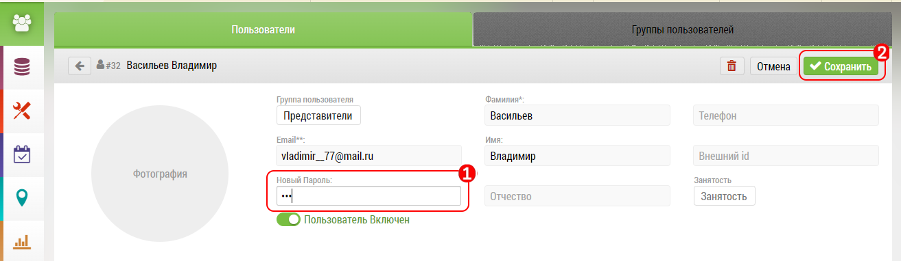

# Изменение пароля пользователя

Изменение пароля пользователя происходит в интерфейсе [редактирования пользователя](accounts-user-edit.html).

Чтобы изменить пароль необходимо зайти в интерфейс редактирования пользователя:

- ввести новый пароль в поле `1`
- подтвердить изменения кнопкой "Сохранить" `2`

> Пользователь не может сам поменять себе пароль.

> Пароль в базе не хранится следовательно его нельзя узнать.
