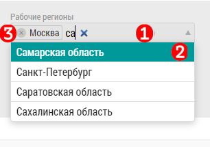

# Рабочий регион. На что влияет. Изменение рабочего региона

Рабочий регион настраивается в интерфейсе [редактирования пользователя](accounts-user-edit.html).
Рабочий регион(регионы) предназначены для фильтрации всей базы у конкретного пользователя.

После настройки и сохранения рабочего региона у пользователя не будет других объектов/субъектов, кроме относящихся к рабочему региону.

> Объекты/субъекты других регионов пропадут из видимости пользователя после установки рабочего региона.

Чтобы задать рабочий регион/регионы необходимо в интерфейсе [редактирования пользователя](accounts-user-edit.html) `5`:

  -  Набирать название региона `1`
  -  Выбрать из всплывающего списка `2` нужный
  -  Повторить для всех нужных регионов
  -  После добавления всех нужных регионов нажать кнопку "Сохранить" 

Чтобы удалить рабочий регион нужно: 
  - Нажать на крестик рядом с регионом `3`
  - Повторить для каждого региона
  - Сохранить изменения кнопкой "Сохранить" 

> Если в базе нет ни одного подтвержденного адреса из региона, регион не будет доступен к выбору