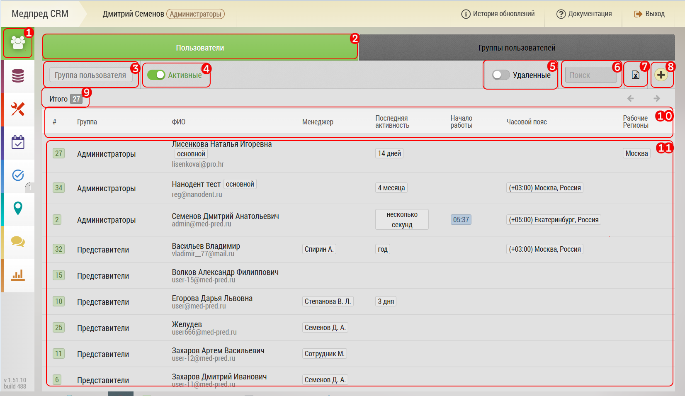

## Список пользователей. Описание элементов страницы и возможности

`Администратор, Менеджер`

Интерфейс список пользователь предназначен для просмотра и управления пользователями.
Здесь можно просматривать, редактировать, удалять пользователей,
назначать им группы, копировать и экспортировать их базы, просматривать активность пользователей.

**Администраторам доступны все пользователи, менеджерам только свои подчиненные.
Часть блоков интерфейса доступна только администраторам.**

Интерфейс список пользователей включает:

1. Кнопка перехода к управлению пользователями (зеленый фон - активно в текущий момент)
2. Вкладки переключения между управлением пользователями и [группами](accounts-group.md) (зеленый фон - активная вкладка)
3. Выбор текущей группы пользователей (белый фон - активная группа)
4. Текстовый фильтр по ФИО пользователя
5. Кнопка [добавления нового пользователя](accounts-user-add.md)
6. [Список пользователей](accounts-user-fields.md) выбранной группы - по нажатию на строку переходим к [редактированию пользователя](accounts-user-edit.md)
7. Информационное окно по статусам геотрекинга
8. Кнопка для раскрытия/скрытия окна [7]
