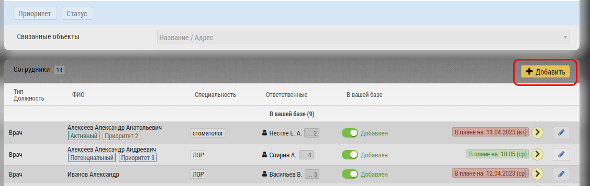

# Добавление нового субъекта (врача/OL)

Для добавления нового врача перейдите в раздел "Клиника" 

> Врач всегда "привязан" к какому либо Объекту и не может существовать самостоятельно без Клиники

1. Перейти на вкладку Клиника
2. Воспользовавшись функцией Текстовый поиск или Фильтры, найти клинику, в которую хотите добавить нового врача
3. В поле клиники, нажмите на карандаш (редактирование) и перейдите в Карточку клиники

Нажмите на кнопку добавить
Далее врача нужно [отредактировать](database-subject-edit.html)
