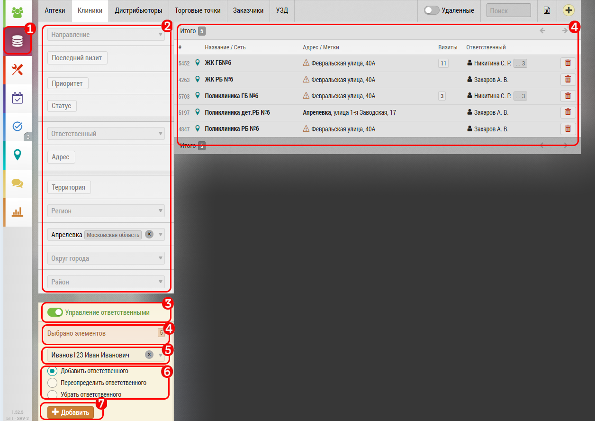
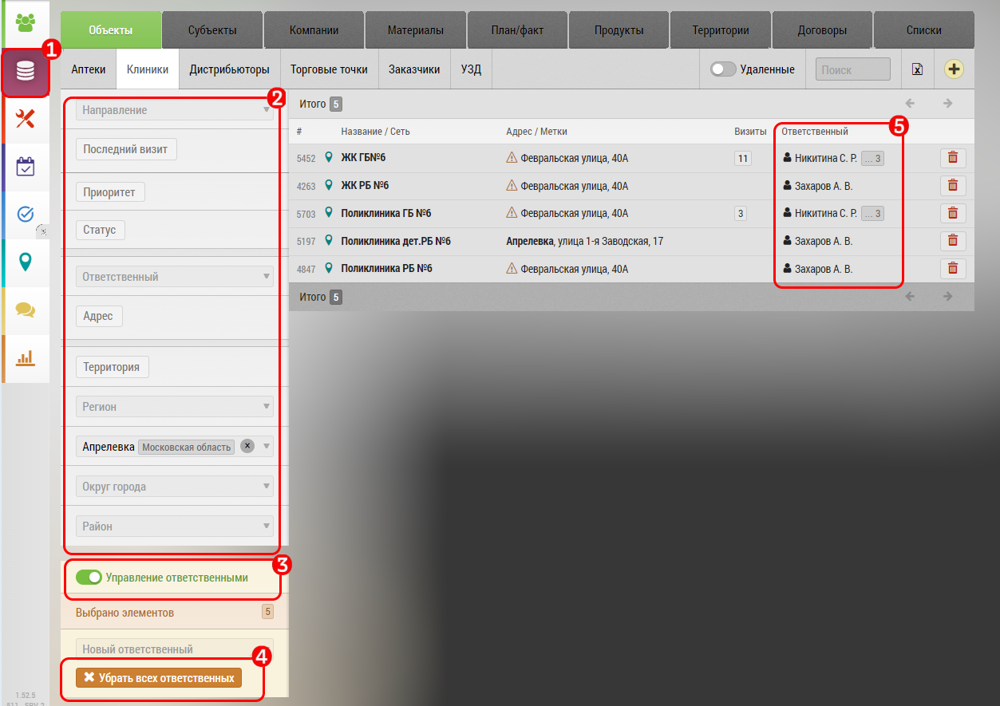

# Управление ответственными

>`Администратор`

Для того что бы изменить ответственных, добавить, заменить или удалить, можно воспользоваться специальной функцией "Управление ответственными"

## Добавить ответственного

Наведите курсор и нажмите на поле «База данных» `1`

В поле  "Фильтры" выберите необходимые настройки списка `2`

В примере выбран г. Апрелевка

Нажмите переключатель «Управление ответственными» `3`

Проверьте, что количество элементов совпадает `4`

Выберите нового ответственного `5`

Отметьте нужный пункт в поле `6` - добавить ответственного

Нажмите `7` - новый ответственный добавится к выбранному списку, к уже ранее назначенным ответственным.

> Если необходимо заменить ответственного - выберите в меню `6` Переопределить ответственного , нажмите коричневую кнопку "Переопределить"

> В этом случае, ранее назначенные ответственные заменятся новым.

> Если необходимо удалить конкретного ответственного - выберите сотрудника в поле `5` , и в поле `6` нажмите переключатель "Убрать ответственного", нажмите коричневую кнопку "Убрать"
 
 ## Удаление всех ответственных

Для удаления всех ответственных пользователей, перейдите на вкладку «База данных» `1`

Выберите нужные объекты или субъекты через поле фильтров `2`

Нажмите переключатель «Управление ответственными» `3`

Нажмите кнопку «Убрать всех ответственных» `4`

Проверьте в поле `5` что ответственных больше нет
