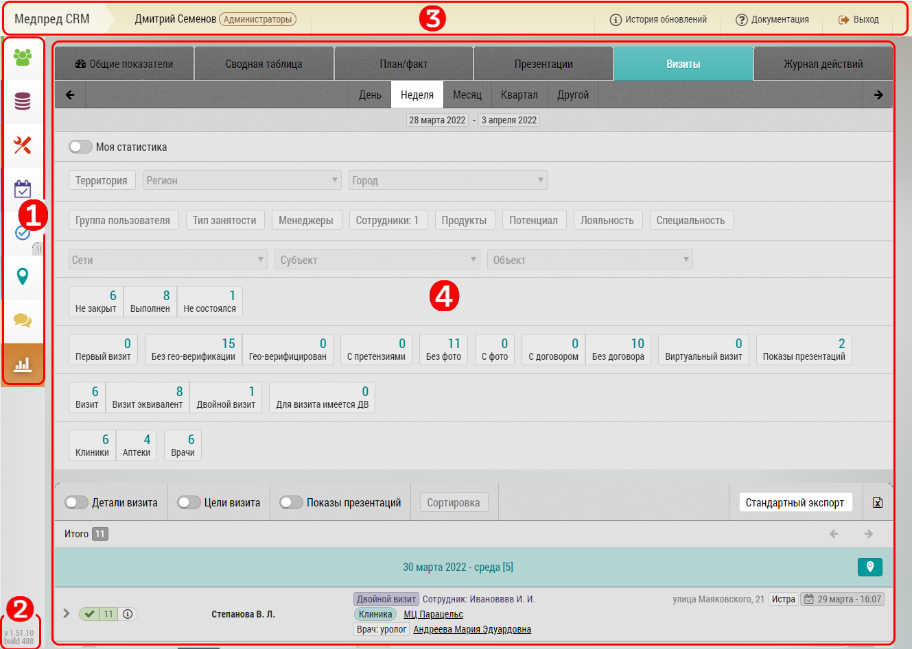

## Описание интерфейса в целом - шапка, левая панель, основное окно

После загрузки программы пользователь видит основной интерфейс программы.

> В зависимости от пользователя/его прав/настроек браузера могут присутствовать не все элементы.

Кнопки переключения текущих режимов работы [1] (сверху вниз):
- Пользователи
- База Данных
- Инструменты
- Планирование
- Карта
- Сообщения
- Отчеты

Информация о текущей версии программы [2] (появляется при наведении курсора).

Верхняя панель [3] (слева направо):
- Логотип программы "Медпред CRM"
- Имя Фамилия пользователя
- Группа пользователя (определяет его права)
- Иконка отслеживания местоположения
- Кнопка доступа к краткой инструкции
- Кнопка "Выйти" для выхода из системы

Основной экран программы [4], содержимое которого зависит от текущего режима работы.

> Кроме указанных элементов во время [обновления](common-update.md) или в [оффлайн](common-offline.md) режиме могут быть и другие элементы.
