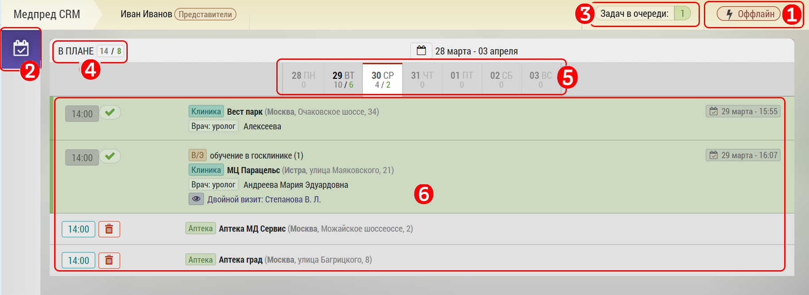

## Оффлайн. Описание возможностей и нюансы

При отсутствии интернета программа переходит в офлайн режим.

Об этом сигнализирует надпись [1]

При этом сохраняется возможность просматривать и заносить итоги визита [2].

> Доступа к другим разделам нет.

При занесении итогов визита данные об изменениях ставятся в очередь [3].

При этом вы получаете уведомление системы:

После появления интернета данные будут синхронизированы как можно быстрее.

Программу можно открыть в офлайн режиме даже после закрытия браузера.
