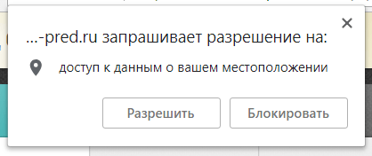

## Авторизация и первый вход

### Вход в программу

При первом запуске программы Медпред CRM, открывается страница авторизации пользователя:

Для входа в программу необходимо заполнить поля "Электронная почта" и "Пароль" и нажать кнопку "Войти".

Если данные не верны пользователь получит сообщение "Неверный логин или пароль".

Популярные ошибки при вводе данных:
- Пробел в начале или конце строки
- Включенный caps lock
- Неверный выбранный язык

> Если зайти так и не получается необходимо обратиться к менеджеру или администратору компании за новыми данными.

> Пароль в системе не хранится. Его можно [сменить](accounts-user-password.md), но нельзя узнать.

### Первый запуск программы

Первый запуск или обновление программы может занять от нескольких секунд до 2-3 минут.

Если запуск продолжается большее время то появится окно:

Необходимо подождать еще некоторое время, и если загрузка не завершится, нажать на кнопку "Перезапустить".

> Нажатие на кнопку "Перезапустить" сбрасывает кеш приложения и может помочь при некоторых проблемах с запуском или обновлением.

### Разрешение на передачу геоданных

После загрузки система запрашивает данные о местоположении.

В зависимости от браузера, настроек геолокации и протокола сайта окно может выглядеть иначе или его может не быть вовсе.

Нужно разрешить программе доступ к данным о местоположении.

Вне зависимости от ответа разрешение можно изменить или отменить в любой момент.
