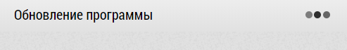

# Обновление программы

Программу нужно своевременно и регулярно обновлять.
Программа сама сообщает, что версия программы устарела и нужно ее обновить.

Для обновления программы нажмите на кнопку "Обновить".

> Не игнорируйте сообщение и всегда старайтесь обновиться как можно быстрее.

После чего появится окно: 

> Если обновление затягивается то появляется окно: 
> 
> 
>
> Подождите еще немного. Если обновление не завершается, то нажмите на кнопку "Ок".

> Узнать текущую версию программы можно посмотрев [левый нижний угол](common-interface.html) `2`.
