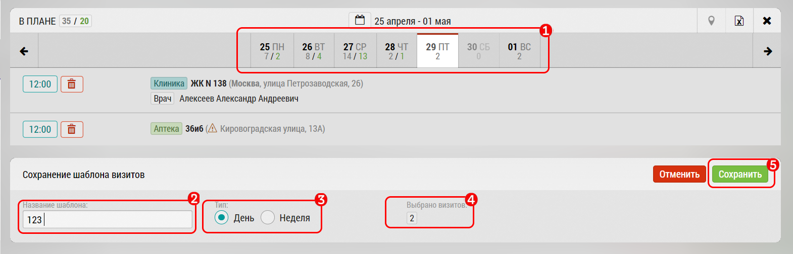
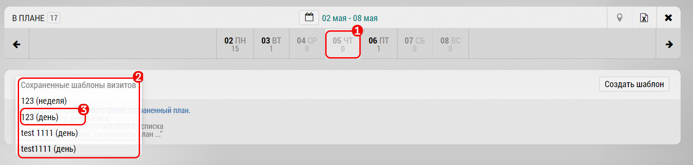
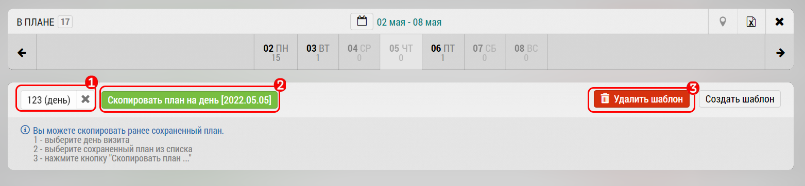

# Копирование визитов на день/неделю

Планирование визитов через копирование визитов дня или недели осуществляется через кнопку "Создать шаблон" в подробном плане внизу справа

1. Выберите день или неделю в календаре Подробного плана который хотите скопировать

 Откроется поле "Создание шаблона визитов" 

2. Присвойте название шаблону визитов

3. Выберите День (создастся шаблон выбранного дня) или Неделя (создастся шаблон выбранной недели)

4. Количество копируемых визитов

5. Сохраните

Для того что бы воспользоваться Шаблонами, перейдите на день или неделю, куда вы хотите скопировать визиты `1`

 `2` Откройте "Сохраненные шаблоны визитов" здесь находится весь список ваших шаблонов

 `3` Выберите нужный шаблон

 

 1. Выбранный шаблон визита
 2. Скопировать план (в примере скопировать план на день)
 3. Вы можете удалить шаблон, если он Вам больше не нужен

 В дальнейшем Вы можете выбирать нужный шаблон и копировать его в любой день или неделю
