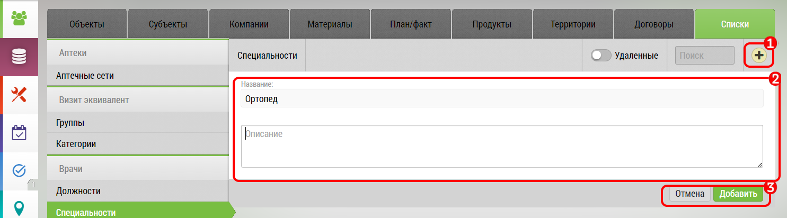

# Добавление элементов списка

Добавление элемента к списку происходит в интерфейсе ["Списки"](database-dict.html) `4`.

Чтобы добавить новый элемент к списку необходимо:

- перейти к нужному списку
  

- Заполнить название `1`
- Нажать на кнопку "Добавить" `2`
  
После добавления пользователь получит стандартное уведомление системы.

> Любой элемент списка - в том числе и свежедобавленный в любой момент можно переименовать или удалить.
