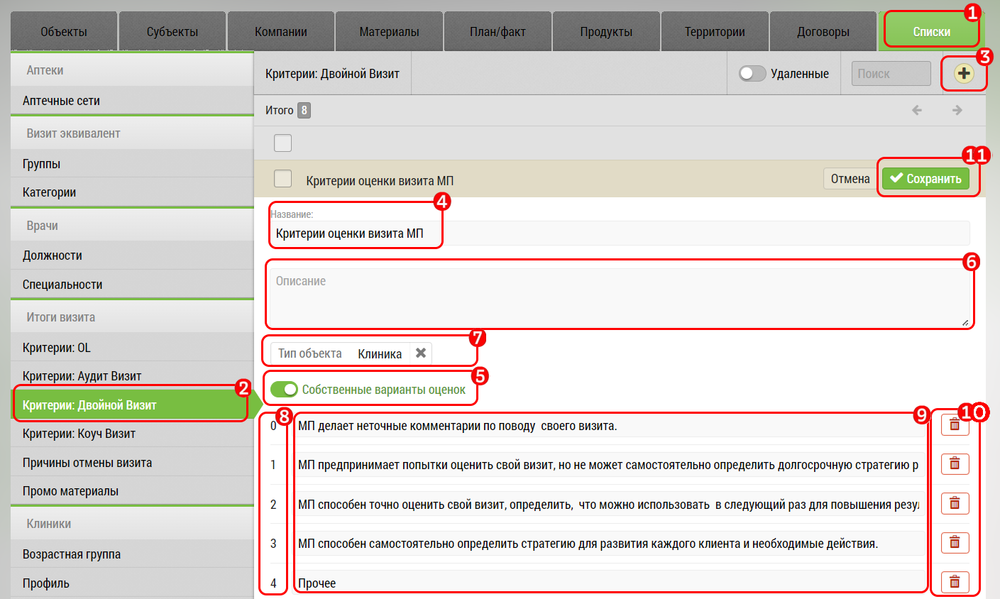

# Редактирование списка собственных критериев

Вы можете добавить собственные критерии для оценки двойных визитов, аудит визитов или коуч-визитов:

  
1. Перейдите База данных - Списки

2. Выберите критерии, которые нужно добавить

3. Через кнопку + добавьте новый критерий оценки

4. Заполните наименование критерия

5. Нажмите переключатель "Собственные варианты оценок" - появится поле для добавления дополнительных критериев

6. Заполните поле "Описание"

7. При необходимости отметьте "Тип объекта", к которому будут применены критерии

8. Оценка критерия, которую в последствие можно будет отметить в [Итогах визита](rep-visits-double.html)

9. Наименование дополнительных критериев оценки (заполняйте от меньшей оценки к большей)

10. Удалить дополнительные оценки критерия

11. Нажмите кнопку "Сохранить"

`Список критериев задается администратором, в разделе "База Данных" -> "Списки" -> "Критерии: Двойной Визит", 
"Критерии: Коуч Визит", "Критерии: Аудит Визит".`
