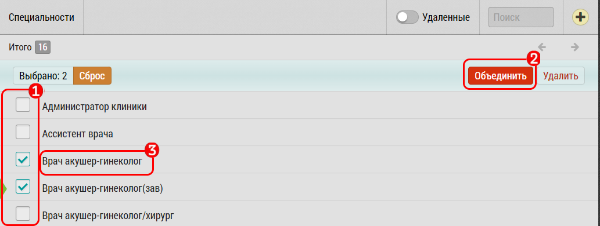

## Объединение (дедубликация) элементов списка

Чтобы объединить элементы списка:

  - Выберите два или более элементов списка которые необходимо объединить [1]
  - Нажмите на кнопку "Объединить" [2]

После объединения в списке останется только первый выбранный элемент (главный). 
При необходимости можно изменить его название [3].
 
Остальные выбранные элементы переносятся в [корзину](database-trash.md) и отвязываются от всех объектов системы в пользу главного.
