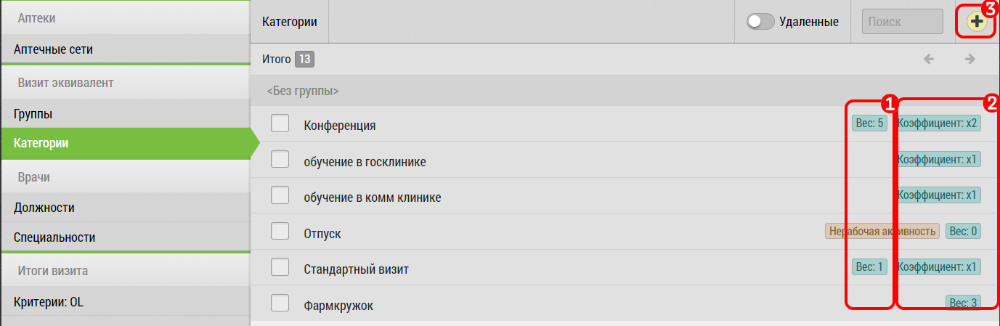

# Особенности визит-эквивалента (вес и коэффициент)

Список элементов "Категории: Визит Эквивалент" отличается от других видов списка которые имеют только название.

Список "Категории: Визит Эквивалент" имеет еще два параметра:

  - вес
  - коэффициент
  
Вес - в случае когда визит эквивалент оценивается в определенное количество часов.
Например, обслуживание машины или фарм -кружок.

Коэффициент доступен если вес не заполнен или равен нулю.
В этом случае указывается коэффициент, на который при [закрытии визита](rep-visits-novisit.html) умножаются проставленные часы.
Например, можно указать больничный с коэффициентом 8, и проставлять часов - 1.
Получится 1 больничный - 8 закрытых часов.
Или работа с повышенным коэффициентом - вечерняя или ночная работа.
