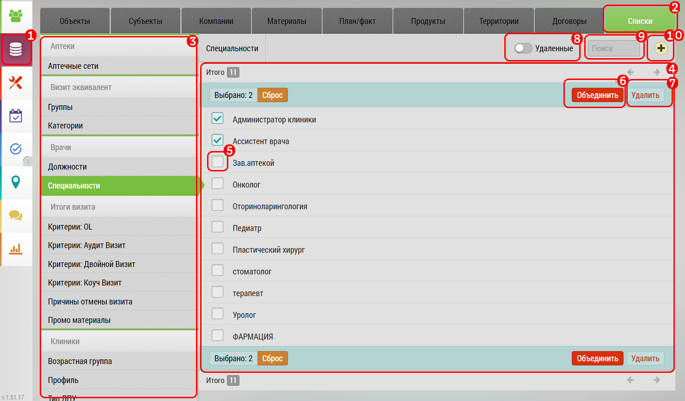

## Списки. Описание элементов интерфейса и возможностей

Вкладка списки содержит различные списки - словари, которые может настраивать администратор.
Например, есть список "Критерии: двойной визит", куда вносятся актуальные для компании критерии оценки "двойного визита".

Элементы списка можно создавать, переименовывать, объединять, удалять.

Интерфейс "Списки":

1. Кнопка для перехода в "База Данных" (не белый фон - активна)
2. Вкладка "Списки" (зеленый фон - активна)
3. Виды списков (зеленый фон - специальности - активный)
4. Элементы списка (Специальности)
5. Переключатели для выделения
6. Кнопка "Удалить" - для удаления элемента списка в [корзину](database-trash.md)
7. Количество выбранных элементов и кнопка сброс для отмены выделения всех элементов
8. Кнопка "Объединить" - для [объединения](database-dict-merge.md) выделенных элементов списка
9. Кнопка "Удалить" - для удаления выделенных элементов списка

Чтобы переименовать элемент списка: 
  - нажмите на его название
  - введите новое или измените 
  - подтвержите изменение всплывающей кнопкой "Сохранить" или отмените изменения кнопкой "Отмена"
