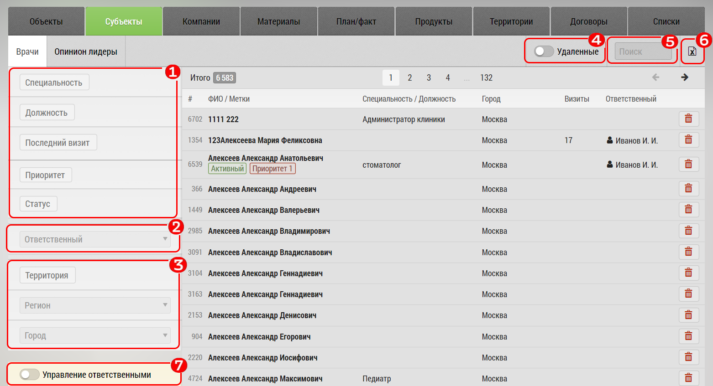

## Экспорт субъектов и объектов

Экспорт субъектов и объектов предназначен для выгрузки данных в формат ексель.

> Выгрузка производится с учетом текущих установленных фильтров.

Для экспорта перейдите на [нужную вкладку](database.md), например врачей.

Установите нужные фильтры, например:
1. По специальности
2. Потенциалу/Лояльности
3. Сотруднику
4. Географические - регион, город, округ
5. [Территория](database-territory.md) - т.е. географические, но заданные вами самостоятельно
6. По ФИО
7. Нажмите кнопку экспорта

Вы получите обычный файл формата xlsx.

> В зависимости от типа вкладки (объект/субъект) фильтры и внешний вид могут незначительно отличаться.
