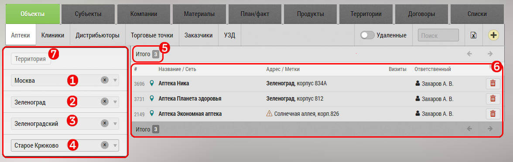

## Фильтр базы по географической принадлежности

Базу объектов/субъектов можно фильтровать по географической принадлежности.
Например выбрать все аптеки Казани или Хабаровского края или ЗАО Москвы.

Также можно внести свои [территории](database-territory.html) - например Центр, Урал или Сибирь и фильтровать по ним.

Чтобы отфильтровать базу нужно перейти на [вкладку](database.html) с нужным видом объектов/субъектов (например аптеки).

Выбрать регион`1`, город`2`, округ города`3` (не у всех городов) или выбрать территорию`4`.

В поле `6` будет показано количество выбранных элементов, а в поле `7` сами элементы.

Убрать фильтр по Территориям можно нажав на пункт "Все" `5`.
Убрать фильтр по региону, городу, округу можно нажав на крестик "x" рядом с ними.
