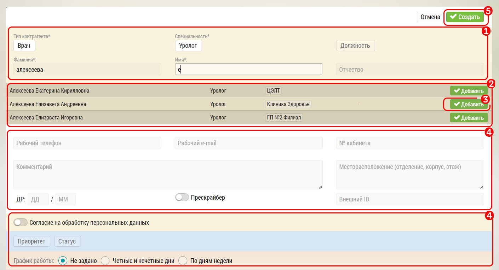

## Добавление субъекта к объекту. Описание (добавить нового или существующего)

Субъекты (врачи, ОЛ) не существуют сами по себе.
Они привязаны к объектам (клиникам).

Добавление нового врача к клинике осуществляется в окне [редактирования объекта](database-object-edit.html).

Чтобы добавить врача к клинике нужно: 

- заполнить основные поля `1`, специальность, ФИО

> При заполнении полей система будет искать подходящих врачей `2`.
> Обязательно проверяйте нет ли того врача, которого вы хотите добавить.
> Если есть - то нажмите кнопку "Добавить" `3`.
> Врач будет добавлен в список [врачей клиники](database-object-subjects.html).

- если подходящего врача не найдено - то заполните все обязательные поля 
- при желании - необходимости заполните дополнительные поля `4`, но врача можно [отредактировать](database-subject-edit.html) и позднее
- нажмите кнопку "Добавить Врача" `5`

Врач будет создан, добавлен в базу пользователя и прикреплен к клинике.
