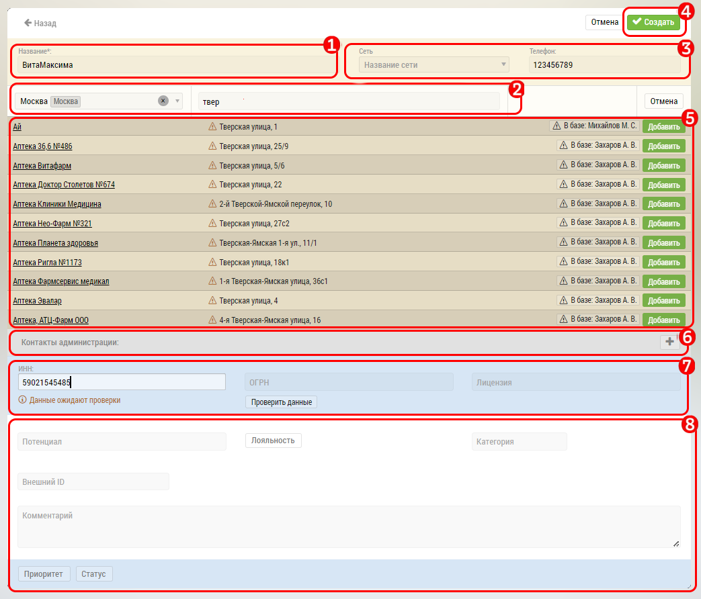

# Добавление объекта. Обязательные поля. Внесение адреса

Для добавления объекта перейдите в окно просмотра нужных [объектов](database-object.html) и нажмите кнопку `7`.

В интерфейсе добавления объекта (например аптеки): 

- Необходимо заполнить обязательные поля (отмечены *):

  - Название `1`
  - Город и адрес`2`
  
  
При добавлении города и адреса система попытается найти подходящие объекты `5`, чтобы избежать дублирования объектов в базе.
Если нужный объект найден - нажмите кнопку "Добавить", а потом "Просмотреть" - чтобы прекратить занесение нового объекта и перейти к найденному.

> Всегда пытайтесь сначала найти объект, а не добавлять новый.
  - Выбрать сеть аптеки, телефон `3`

- Можно добавить [контакты администрации](database-object-contact.html) `6`  

- Можно заполнить поле `7` - проверить объект по ИНН или ОГРН
- `8` дополнительные поля для заполнения
- Нажать кнопку "Добавить Аптеку" `4`

После нажатия на кнопку "Создать" `4` система попытается проверить (валидировать) адрес и по итогам проверки выдаст одно из следующих сообщений:
 
- Адрес подтвержден
- Найден номер дома, но не найдено строение или корпус
- Найден дом с номером, близким к запрошенному
- Найдены приблизительные координаты запрашиваемого дома
- Найдена только улица
- Улица не найдена

Также система попытается привести адрес к единому стандарту.

> Всегда старайтесь получить валидный и существующий адрес.
