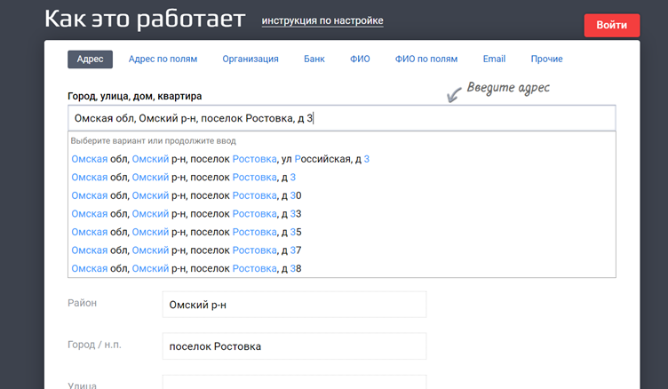

# Распознавание адреса объектов

После того как Вы создали новый Объект, система попытается проверить (валидировать) адрес и по итогам проверки выдаст одно из следующих сообщений:
 
- Адрес подтвержден
- Найден номер дома, но не найдено строение или корпус
- Найден дом с номером, близким к запрошенному
- Найдены приблизительные координаты запрашиваемого дома
- Найдена только улица
- Улица не найдена

Если адрес не подтвержден, или подтвержден не полностью, воспользуйтесь следующим алгоритмом:

## Подтверждение адреса в России

1. Перейдите на https://dadata.ru/suggestions/#address, скопируйте и вставьте адрес в строку поиска:

2. Начните по-порядку набирать сначала улицу, потом дом, строение – выбирайте из списка предложенных

3. Скопируйте адрес в программу, сохраните
4. Проверьте что адрес на карте в программе Медпред соответствует той точке, где фактически должен быть

> Адрес будет соответствовать ФИАСу

> Иногда программа может не распознавать корпуса и строения по заданному адресу объекта, в этом случае сохраните адрес с точностью до дома, и вручную измените геометку на карте, разместив ее на нужном строении.

## Подтверждение адреса в другой стране

1. Перейдите на https://dadata.ru/suggestions/#address
2. Переключитесь на иностранные города (2)

 
3. Начните по-порядку набирать сначала улицу, потом дом, строение – выбирайте из списка предложенных (1)
4. Скопируйте адрес в программу, сохраните
5. Проверьте что адрес на карте в программе Медпред соответствует той точке, где фактически должен быть

> Можно подтвердить адреса в Казахстане, Узбекистане, Беларуси
