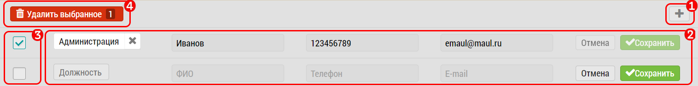

## Контакты. Описание, добавление, удаление

В программе для объектов (например аптек), можно управлять контактами администрации.
Они предназначены для хранения информации о контактах - например администрации или фармацевтах.

Чтобы перейти к контактам нужно перейти в окно [редактирования объекта](database-object-edit.md) [3].

- чтобы добавить контакт нажмите кнопку [1]
- заполните поля [2]. 

> Список возможных должностей заполняется в [управлении списками](database-dict.md): "Должности:Сотрудники организаций"

При необходимости можно выделить контакты [3], и удалить [4].

Увидеть контакты аптеки можно в [списке планирования](rep-planning-central-block-objects.md) или в окне [редактирования объекта](database-object-edit.md).
