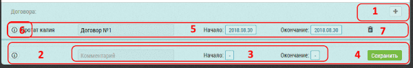
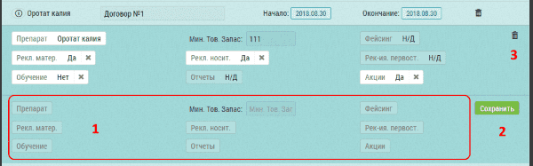

# Добавление договора

Договор добавляется в интерфейсе [редактирования объекта (аптеки)](database-object-edit.html).

> На текущий момент договоры можно добавлять только через Техническую поддержку

Чтобы добавить договор необходимо: 

- Перейти в к [редактированию аптеки](database-object-edit.html)
- Перейти к разделу договоры (Дополнительные данные и договора)

- Нажать кнопку плюс `1`
- Заполнить поля `2`, такие как - комментарий, начало и окончание договора, и "Cохранить" `4`

- После сохранения договор будет отображен в списке договоров  `5`
- Для изменения данных о названии или дате - измените их и нажмите на всплывающую кнопку "Сохранить" 
- Удалить сам договор можно кнопкой "Корзина" `7`

- Просмотреть, добавить изменить или удалить условия договора можно кнопкой `6`

 
- Заполните нужные поля  `1`
- Нажмите кнопку "Сохранить" `2`
- При необходимости информацию относящуюся к конкретному препаратау можно удалить кнопкой "Корзина" `3`
