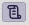
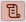

# Договора (общая информация)

Договора - возможность оформить некоторые условия сотрудничества с объектом - такие, например, как наличие, запас, выкладка.
И далее отслеживать и учитывать эти условия в работе, при закрытии визитов, в статистике.

> На текущий момент договора используются только с аптеками.

Договора [добавляются](database-object-contract-add.md) в интерфейсе [редактирования аптеки](database-object-edit.md).

При занесении итогов визита в аптеку есть возможность оформить [претензионный лист](rep-visits-treaty.md).

Аптеки с активным договором отображаются со значком  перед названием.
Этот значок выводится как в списке планирования, так и в кратком и подробном планах.

Если по визиту оформлена претензия то значок будет красным .

В статистике визит с претенцией также будет отмечен красным значком.
