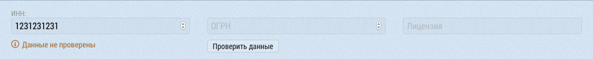
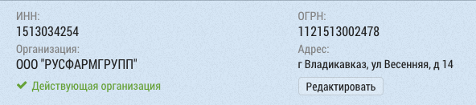
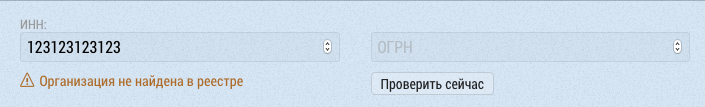

# Проверка ИНН и ОГРН. Привязка объекта к организации.

После заполнения полей ИНН или ОГРН появляется возможность проверить введеные данные. Для этого нужно нажать кнопку `Проверить данные`

Проверка осуществляется по базе ЕГРЮЛ и в случае указания корректных данных будет отображена информация об организации. 

> Достаточно указать ИНН или ОГРН, второе значение будет автоматически заполнено после проверки.

В случае необходимости можно изменить ИНН или ОГРН нажав на кнопку `Редактировать`.

Если по указанным данным организация не была найдена будет

> Проверка не сохраняет найденные данные организации пока не будет сохранен сам объект.

> Проверка ИНН и ОГРН происходит автоматически после сохранения самого объекта.
