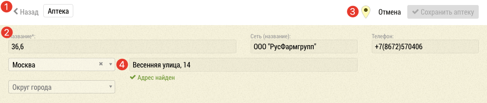
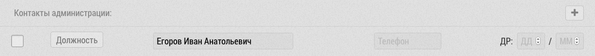
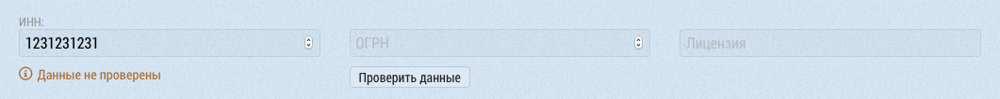
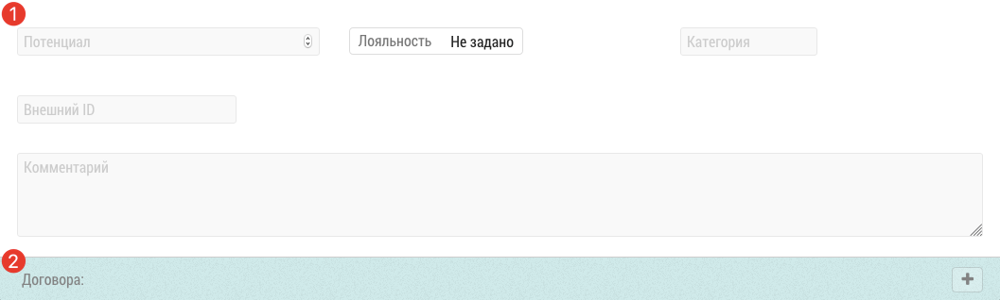

# Страница редактирования объекта.

Страница редактирования объекта предназначена для просмотра и изменения данных об объекте.

В зависимости от типа объекта (ЛПУ, Аптека, торговая точка) форма может иметь некоторые различия в полях.

## Основные поля

Верхняя панель `1` помимо кнопок сохранения и навигации содержит маркер `3`, который указывает что у объекта определены географические координаты. Нажав на маркер можно посмотреть объект на карте.

Основные поля содержатся в блоке `2`. Рядом с адресом объекта `4` выводится статус проверки адреса.

> Введенный адрес проверяется на сервере и приводится к единому формату. Если адрес не был найден или часть адреса не совпадает с найденным, то будет выведено соответствующее предупреждение.

## Контакты администрации

Подробнее о работе с блоком контактов см раздел: [Контакты объекта](database-object-contact.html)

## Данные организации (ИНН, ОГРН, Лицензия)

Данный блок позволяет проверить введенные данные с базой ЕГРЮЛ и связать объект организацией из данного реестра.
Подробнее в разделе: [Проверка ИНН и ОГРН](database-object-edit-inn-check.html)

## Дополнительные данные и договора

Блок с дополнительными `1` данными содержит разные поля в зависимости от типа объекта.

В частности для аптек можно задать [условия договора](database-object-contract.html) `2` по отдельному продукту.

## Связанные субъекты (врачи, опинион лидеры)

В клиниках в самом низу выводится блок со списком врачей, подробнее об этом смотрите в соответствующем [разделе](database-object-subjects.html)