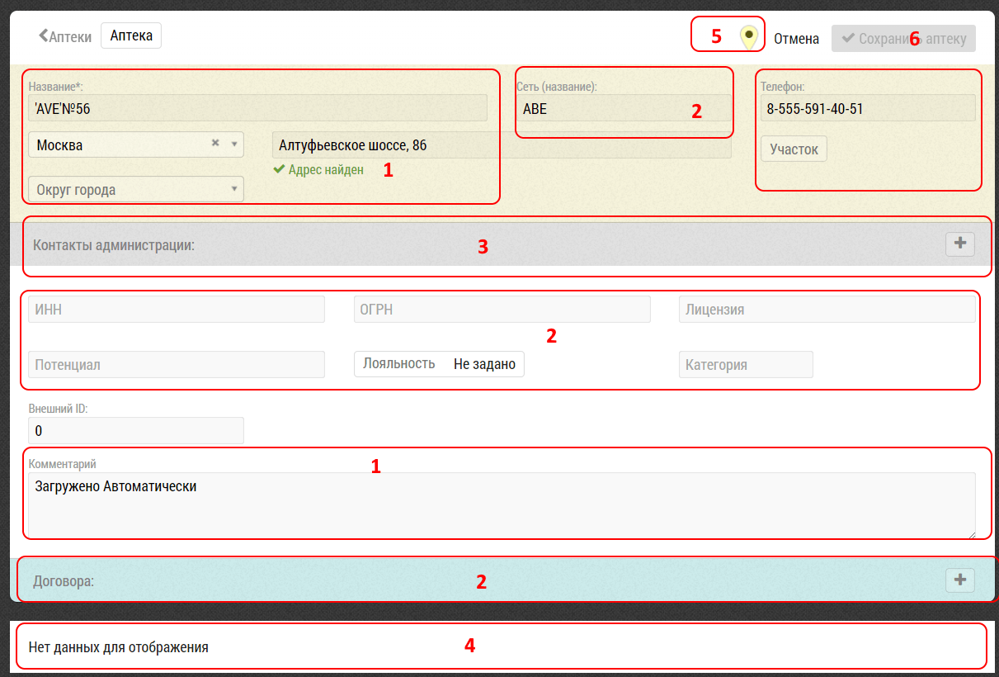

## Страница редактирования объекта. Описание элементов интерфейса и возможностей

Страница редактирования объекта предназначена для просмотра и изменения данных об объекте.

В зависимости от объекта кроме общих полей `1`:

- название
- адрес
- телефон
- информация о визитах`4`
- ...
- иконка для перехода к объекту на карте `5`

есть индивидуальные для различных типов объектов `2`

- [контакты администрации](database-object-contact.html)`3`
- договора
- ИНН, ОГРН, лицензия
- [субъекты - т.е. например врачи в клиниках](database-object-subjects.html)
- ...

После редактирования объекта сохраните изменения кнопкой "Сохранить Аптеку" `6`.
