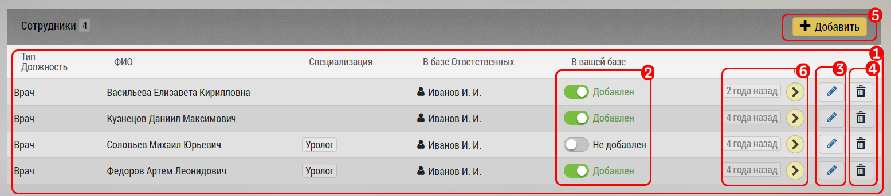

## Список субъектов у объекта

Субъекты (врачи, ОЛ) не существуют сами по себе.
Они привязаны к объектам (клиникам).

Увидеть существующих привязанных к объекту субъектов можно в окне [редактирования объекта](database-object-edit.md) - клиники.

- Список врачей клиники [1]
- Метка - переключатель [2] - есть этот врач в списке пользователя или нет

> В клинике может быть много врачей, но не все они нужны пользователю, и ему удобно видеть не всех врачей клиники, а например только терапевтов

- кнопка перехода к редактированию врача [3]
- кнопка удаления врача из клиники [4]. При удалении будет запрошено подтверждение

> Кнопка [4] не удаляет врача совсем, а просто отсоединяет его от клиники.

> Врач может работать в нескольких клиниках.

Добавить нового субъекта можно в блоке [добавления субъекта к объекту](database-object-add-subject.md).
