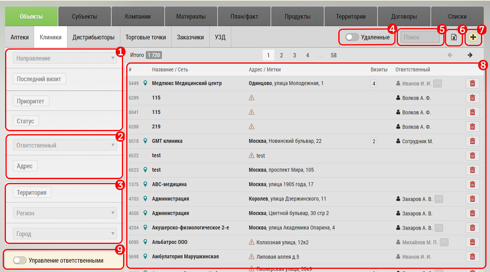

# Управление объектами. Описание элементов интерфейса и возможностей

Вкладки управления объектами (например аптеками или клиниками) предназначены для просмотра базы объектов, экспорта, поиска и фильтрации.

На текущий момент в системе есть следующие виды объектов, отличающиеся главным образом наличием у них субъектов - к которым можно осуществлять визит:

- Клиники

или только контактов:

- Аптеки
- А/С (аптечные сети)
- Дистрибюторы
- Торговые точки
- Заказчики
- УЗД

Интерфейс управления объектом "Клиники":

1. Фильтр по последнему визиту, приоритету и статусу
2. Фильтр по [сотруднику](database-user.html)
3.  Фильтр по [географическому расположению](database-geo.html)
4. Переключатель удаленных клиник
5. Текстовый фильтр по названию и адресу
6. Кнопка [экспорта](database-export.html)

7. Кнопка , для [добавления нового объекта](database-object-add.html)
8. Поле с основной информацией

Поле с основной информацией `8` содержит:
- ID объекта
- Название объекта
- Адрес/Метки
- Количество визитов
- Ответственный
- Кнопку "Удалить" - для удаления субъекта

По нажатию на строку в поле `8` можно перейти к [редактированию объекта](database-object-edit.html).

9. Управление ответственными

Интерфейс управления объектом "Аптеки":

1. Фильтр по сети
2. Фильтр по параметрам аптеки
3. Фильтр по [сотруднику](database-user.html)
4. Фильтр по [географическому расположению](database-geo.html)
5. Переключатель удаленных аптек
6. Текстовый фильтр по названию и адресу
7. Кнопка [экспорта](database-export.html)
8. Кнопка , для [добавления нового объекта](database-object-add.html)
9. Поле с основной информацией

Поле с основной информацией `9` содержит:
- ID объекта
- Название объекта
- Адрес/Метки
- Количество визитов
- Ответственный
- Кнопку "Удалить" - для удаления субъекта

По нажатию на строку в поле `9` можно перейти к [редактированию объекта](database-object-edit.html).

10. Управление ответственными

