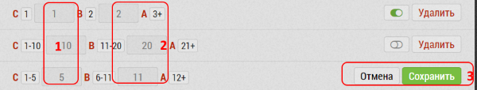

## Установка диапазонов потенциала и лояльности

Потенциал/лояльность препаратов задаются числами.
Но каждому числу-диапазону чисел можно назначить соотвествие латинских букв "A", "B", "C".

Чтобы сопоставить диапазон цифр:

- в поле `1` введите нужное число для задания диапазона "C".
В примере это 1, 10, 5 соответственно.
Это задаст для "С" диапазоны: 1-1, 1-10, 1-5 - видно рядом с буквой "C"
- в поле `2` введите нужное число для задания диапазона "B".
В примере это 2, 20, 11. Это конец диапазона "B", начало берется из Диапазона "C".
Получится для "B" диапазоны: 2, 11-20, 6-11 - видно рядом с буквой "B"
- Для "А" получается диапазон - всё что больше "B". Т.е. 3, 21, 12 и больше

Чтобы Сохранить изменения нажмите кнопку "Сохранить" `3`.
Чтобы отменить "Отмена".

Диапазоны будут использоваться при занесении итогов визита и в статистике.
