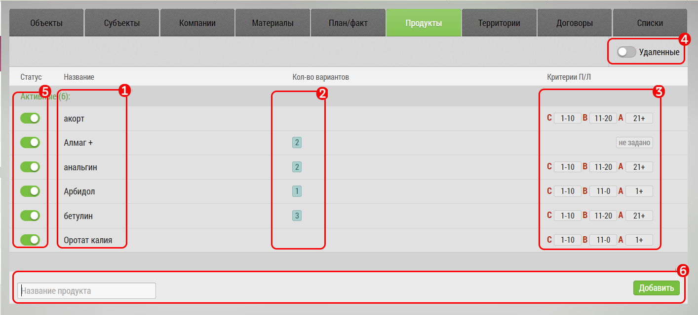

## Продукты. Описание элементов интерфейса и возможностей

Окно продукты - предназначено для создания и редактирования списка продуктов (препаратов).

Препараты можно:
- добавлять
- редактировать
- удалять
- настраивать им [потенциал/лояльность](database-product-pl.md)
- временно отключать

Чтобы добавить новый препарат: 

- нажмите кнопку "Добавить" [1]
- заполните поля [2], в том числе

   - название [3]
   - [потенциал/лояльность](database-product-pl.md) [4]

Чтобы временно отключить или обратно включить препарат, нажмите переключатель [5].

Чтобы удалить препарат нажмите кнопку "Удалить" [6].

Временно отключенный препарат остаетс в базе но становится недоступным в окне занесения итогов визита.
