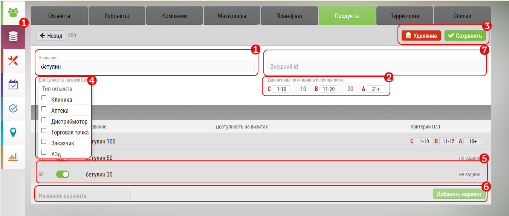

# Продукты. Описание элементов интерфейса и возможностей

Окно продукты - предназначено для создания и редактирования списка продуктов (препаратов).

Препараты можно:
- добавлять
- редактировать
- удалять
- настраивать им [потенциал/лояльность](database-product-pl.html)
- временно отключать

- Название препаратов `1`
- Количество форм препататов (SKU) `2`
- [Потенциал/лояльность](database-product-pl.html) `3`
- Переключение на удаленные продукты `4`

Чтобы временно отключить или обратно включить препарат, нажмите переключатель `5`.

> Временно отключенный препарат остаетс в базе, но становится недоступным в окне занесения итогов визита.

Для добавления продукта в поле `6` наберите название, и нажмите кнопку "Добавить"

При нажатии на строку продукта откроется форма редактирования продукта:

`1` Поле редактирования названия продукта

`2` Редактирование потенциала/лояльность

`3` Удаление продукта

`4` Кнопка "Сохранить"

`5` Вариации продукта

`6` Добавить вариацию продукта

[Посмотреть видео "Добавление продуктов" ](https://storage.yandexcloud.net/support-files/video/database-product.mp4)
 