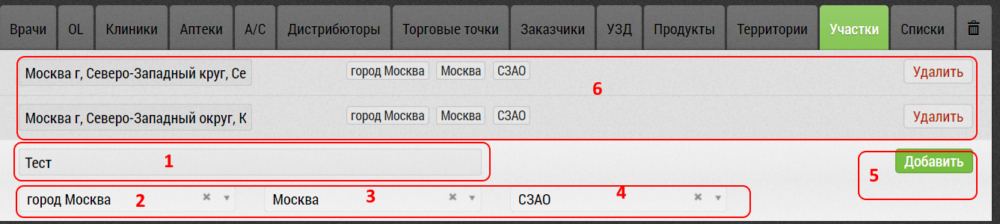

## Участки. Добавление

Для того, чтобы добавить новый участок: 

-перейдите на [вкладку "Участки"](database.md).

- заполните название [1]
- регион [2], город [3], округ (при необходимости) [4]
- нажмите на кнопку "Добавить" [5]

Участок появится в списке участков [6].
