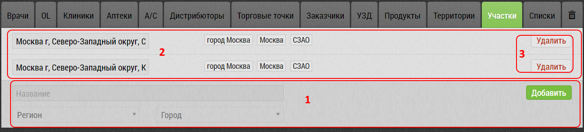

## Участки. Описание элементов интерфейса и возможностей

Участок - часть города или объединение нескольких небольших населенных пунктов определяемая администрацией.
Фактически, это настраиваемое географическое деление объектов.

В настоящее время используется только как дополнительное поле у объекта.

[Вкладка](database.html) "Участки":

1. Блок для [добавления нового участка](database-sector-add.html)
2. Существующие уже [участки](database-sector-edit.html)
3. Кнопка "Удалить" для удаления Участка

> При удалении учаcтка запрашивается подтверждение. 
> Участок попадает в корзину откуда его можно [восстановить](database-trash-restore.html).
