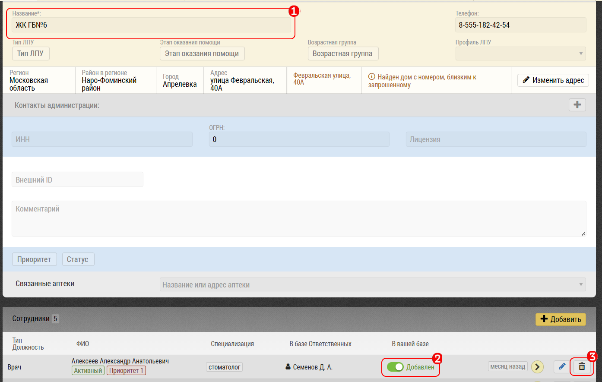

# Добавление места работы врачу через карточку врача

Перейдите в раздел “Планирование»  `1`

Выберите вкладку “Врачи» `2`

Найдите врача, которому Вы хотите добавить место работы `3`

Нажмите значок редактирования `4` 

Откроется интерфейс редактирования карточки врача

Перейдите к блоку «Место работы»

Выберите объект для добавления места работы `1`

Добавьте новое место работы `2`

Теперь можно выбрать для планирования визитов новое место работы врача.

## Удалить место работы врача

Для того, чтобы удалить врача из клиники перейдите в 

карточку клиники, нажав на значок редактирования, рядом с 

кнопкой планирования визита к врачу:

Убедитесь, что отключаете врача из нужной клиники `1`

Вы можете отключить врача из своей базы, нажав на переключатель`2`, или, при наличии прав на удаление субъектов, удалить врача совсем `3`

При удалении врача, программа выдаст запрос:

Подтвердите действие - врач будет удален