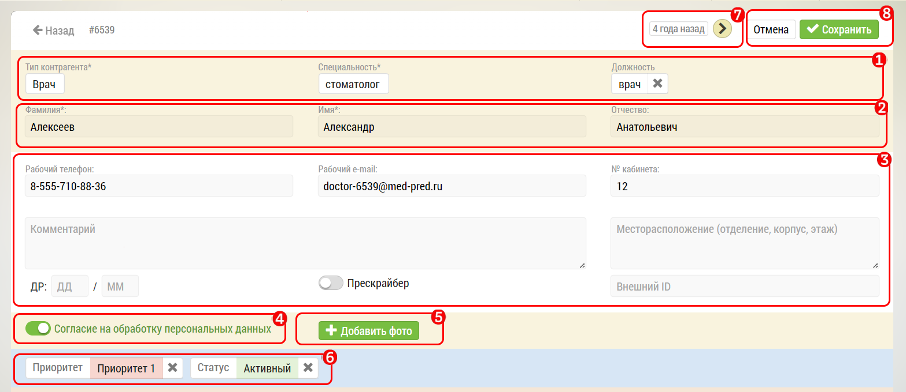
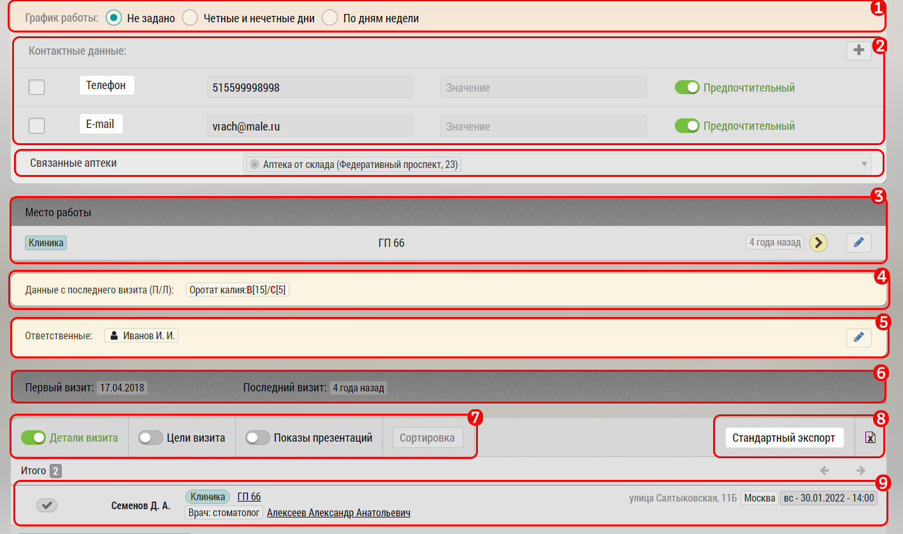

# Страница редактирования субъекта. Описание элементов интерфейса и возможностей

Страница редактирования субъекта (например врача) предназначена для изменения данных субъекта.

Также на странице можно увидеть активность по этому субъекту - первый и последний визит, места работы субъекта.

Интерфейс редактирования субъекта (врача):

1. Тип субъекта, специальность, должность (врач/ОЛ)
2. ФИО субъекта
3. Персональные данные по субъекту:

    * Телефон
    * Емайл
    * Номер кабинета
    * Местоположение
    * Комментарий по субъекту
    * День и месяц рождения
    * Переключатель "Прескрайбер"
    * Внешний Id - для связи с внешней базой данных
4. Наличие согласия на обработку персональных данных
5. Добавить фото или скан согласия на обработку персональных данных  
6. Метки субъекта
7. Информация о последнем визите, и кнопка "Запланировать визит к врачу"

8. Кнопка "Отмена" - выход из режима редактирования
   Кнопка "Сохранить" - сохранить внесенные изменения

1. Блок [Режим Работы](database-subject-schedule.html)
2. Добавление и редактирование контактных данных, ниже
Блок [связанные аптеки](database-subject-pharmacy.html)
3. Места работы (субъект может иметь больше одного места работы)
4. Данные с последнего визита
5. Ответственный сотрудник по субъекту
6. Информация о первом визите и информация о последнем совершенном визите
7. Раскрытие дополнительной информации и сортировка блока `9`
8. Стандартный экспорт в XLS
9. Блок визитной активности по субъекту с возможностью просмотра
