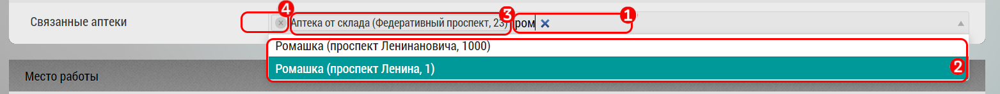

## Связанные аптеки

Связанные аптеки - это аптеки, которые привязаны к определенному субъекту (врачу).
К врачу можно привязать хоть сколько аптек.

Чтобы привязать аптеку к субъекту необходимо перейти в окно [редактирования субъекта](database-subject-edit.md) [15].

- Начать вводить название или адрес аптеки в поле [1]
- Выбрать из всплывающего списка [2]
- Аптека добавиться в список [3]

При необходимости аптеку можно удалить из связанных нажав на крестик рядом с ней [4].

> Для добавления аптеки в связанные нужно чтобы она была добавлена у пользователя в базу.
