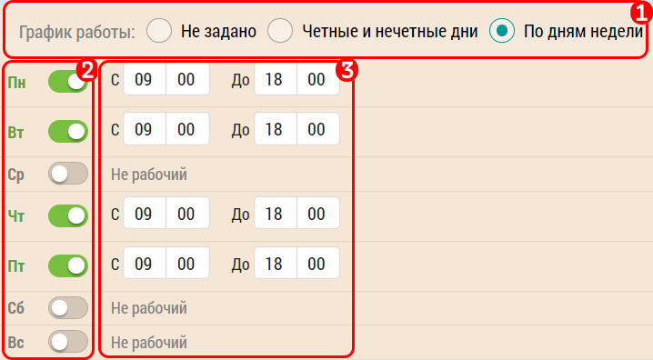

## Режим работы субъекта

Поле "Режим работы" субъекта предназначено для занесения информации о режиме работы.
Оно предназначено для быстрой проверки режима работы [при планировании в календаре](rep-add-calendar.md).

Чтобы заполнить "Режим работы" необходимо перейти к [редактированию субъекта](database-subject-edit.md) [14].

В настоящий момент есть 3 варианта "Режима работы":

- не задано
- четные и нечетные дни
- по дням недели

Чтобы задать или отредактировать "Режим работы" надо:

- выбрать режим (например дни недели) [1]
- с помощью переключателей [2] выбрать рабочие дни
- задать время для рабочих дней [3] от 6:00 до 21:55 с шагом в 5 минут
- после задания режима работы сохраните изменения кнопкой "сохранить"

Для "Четные и нечетные дни" аналогично только там не 7 дней недели, а два варианта.
